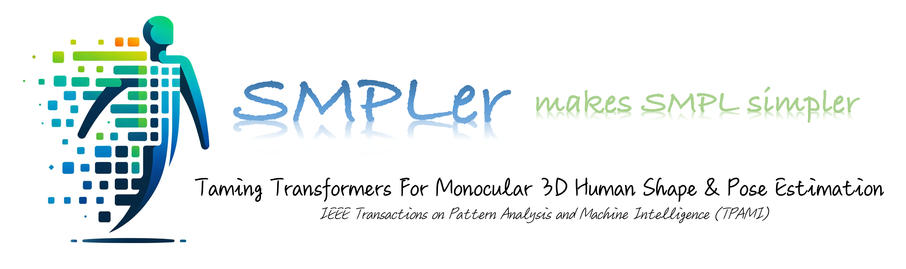
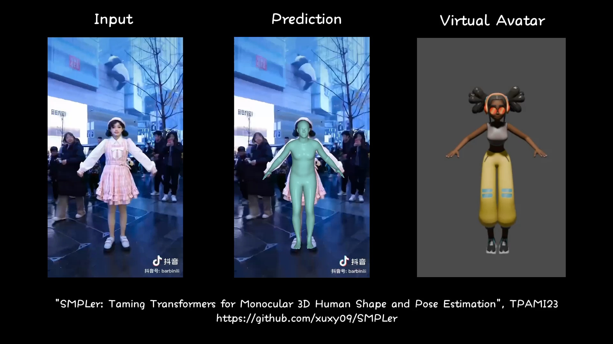

<div align="center">
    
    <br>
    <br>
    <h1>&#x1F525; SMPLer: Taming Transformers for Monocular 3D Human Shape and Pose Estimation &#x1F525;</h1>
    <p style="font-size:18px; "><a href="https://xuxy09.github.io/">Xiangyu Xu</a>,&nbsp;&nbsp;&nbsp; <a href="https://scholar.google.com/citations?user=nANxp5wAAAAJ&hl=en">Lijuan Liu</a>,&nbsp;&nbsp;&nbsp; <a href="https://yanshuicheng.info/">Shuicheng Yan</a></p>
    <p style="font-size:18px; "><em><strong><a href="url">arXiv</a> &nbsp;&nbsp;&nbsp; <a href="http://en.xjtu.edu.cn/">Xi'an Jiaotong University</a></strong></em></p>
</div>

[](assets/kemu3.mp4)

## Abstact
Existing Transformers for monocular 3D human shape and pose estimation typically have a quadratic computation and memory complexity with respect to the feature length, which hinders the exploitation of fine-grained information in high-resolution features that is beneficial for accurate reconstruction. In this work, we propose an **SMPL**-based Transform**er** framework (**SMPLer**) to address this issue. SMPLer incorporates two key ingredients: a decoupled attention operation and an SMPL-based target representation, which allow effective utilization of high-resolution features in the Transformer. In addition, based on these two designs, we also introduce several novel modules including a multi-scale attention and a joint-aware attention to further boost the reconstruction performance. Extensive experiments demonstrate the effectiveness of SMPLer against existing 3D human shape and pose estimation methods both quantitatively and qualitatively. Notably, the proposed algorithm achieves an MPJPE of 45.2mm on the Human3.6M dataset, improving upon Mesh Graphormer by more than 10% with fewer than one-third of the parameters.

## Highlights
- Decoupled attention design
- SMPL-based target representation
- Significantly reduced computation and parameter overhead
- Exploitation of high-resolution features
- Multi-scale attention moduel and joint-aware attention module
- MPJPE of 45.2 on Human3.6M surpassing SOTA by over 10%


## Results
<div align="center">

| Method                        | Parameters (M) | MPJPE ↓ (Human3.6M) | PA-MPJPE ↓ (Human3.6M) | MPVE ↓ (3DPW) | MPJPE ↓ (3DPW) | PA-MPJPE ↓ (3DPW) |
|-------------------------------|:----------------:|:---------------------:|:------------------------:|:---------------:|:----------------:|:-------------------:|
| METRO       | 231.8          | 54.0                | 36.7                   | 88.2          | 77.1           | 47.9              |
| Mesh Graphormer | 215.7      | 51.2                | 34.5                   | 87.7          | 74.7           | 45.6              |
| **SMPLer**                        | **35.6**           | 47.0                | 32.8                   | 84.7          | 75.7           | 45.2              |
| **SMPLer-L**                      | 70.2           | **45.2**            | **32.4**               | **82.0**      | **73.7**       | **43.4**          |

</div>

---
---


## 1. Install
- Hardware requirements

    **For Testing**: Most modern GPUs are adequate.

    **For Training**: It is recommended to use 2 NVIDIA A100 GPUs.

- Create conda environment
    ```bash
    conda create -n smpler python=3.8
    conda activate smpler
    ```

- Install packages
    ```bash
    pip install torch==1.8.0+cu111 torchvision==0.9.0+cu111 torchaudio==0.8.0 -f https://download.pytorch.org/whl/torch_stable.html

    pip install scipy==1.5.0 scikit-image==0.19.1 opencv-python==4.5.4.58 imageio matplotlib numpy==1.20.3 chumpy==0.70 ipython ipykernel ipdb smplx==0.1.28 tensorboardx==2.4 tensorboard==2.7.0 easydict pillow==8.4.0
    ```

- Install Pytorch3D
    ```bash
    conda install -c fvcore -c iopath -c conda-forge fvcore iopath
    conda install -c bottler nvidiacub

    wget https://anaconda.org/pytorch3d/pytorch3d/0.5.0/download/linux-64/pytorch3d-0.5.0-py38_cu111_pyt180.tar.bz2 --no-check-certificate
    
    conda install pytorch3d-0.5.0-py38_cu111_pyt180.tar.bz2
    
    rm pytorch3d-0.5.0-py38_cu111_pyt180.tar.bz2
    ```

## 2. How to Run
- Download [meta data](https://xjtueducn-my.sharepoint.com/:u:/g/personal/xiangyu_xu_xjtu_edu_cn/ER5jWWesn0ZHjZQNWkixOZABifez3WFVlrcSQbv7vhduCQ?e=yCYrJW) and extract it into "PATH_to_SMPLer/meta_data"

- Download [pretrained models](https://xjtueducn-my.sharepoint.com/:u:/g/personal/xiangyu_xu_xjtu_edu_cn/EUpZDGdn585DjiQZ8Eg89nYBZRKnyjbint-9fYD0_ECz3Q?e=6NRgb5) and extract it into "PATH_to_SMPLer/pretrained"

- Run demo
    ```bash
    python demo.py --img_path samples/im01.png
    ```

## 3. Train and Test
### 3.1 Prepare Datasets
There are two ways to download the datasets: azcopy and wget. 

**Recommended way: azcopy (faster)**
- Download azcopy from [here](https://learn.microsoft.com/en-us/azure/storage/common/storage-use-azcopy-v10#download-azcopy)

- Download datasets with azcopy:
    ```bash
    cd PATH_to_STORE_DATASET
    azcopy_path=PATH_to_AZCOPY
    bash PATH_to_SMPLer/scripts/download_datasets_azcopy.sh
    ```

- Create a symbolic link:
    ```bash
    cd PATH_to_SMPLer
    ln -s PATH_to_STORE_DATASET ./datasets
    ```

Alternative way: wget (usually slower and less stable, but no dependency on azcopy)
-  Download datasets with wget:
    ```bash
    cd PATH_to_STORE_DATASET
    bash PATH_to_SMPLer/scripts/download_datasets_wget.sh
    ```


### 3.2 Test
- Test on H36M dataset (models are trained on mixed data: Human3.6M, COCO, MuCo, UP-3D, and MPII)
    ```bash
    # for SMPLer
    python -m torch.distributed.launch --nproc_per_node=2 --use_env main.py --eval_only --val_batch_size=128 --model_type=smpler --data_mode=h36m --hrnet_type=w32 --load_checkpoint=pretrained/SMPLer_h36m.pt 

    # for SMPLer-L 
    python -m torch.distributed.launch --nproc_per_node=2 --use_env main.py --eval_only --val_batch_size=128 --model_type=smpler --data_mode=h36m --hrnet_type=w48 --load_checkpoint=pretrained/SMPLer-L_h36m.pt 
    ```

- Test on 3DPW dataset (models are finetuned on 3DPW)
    ```bash
    # for SMPLer
    python -m torch.distributed.launch --nproc_per_node=2 --use_env main.py --eval_only --val_batch_size=128 --model_type=smpler --data_mode=3dpw --hrnet_type=w32 --load_checkpoint=pretrained/SMPLer_3dpw.pt 

    # for SMPLer-L 
    python -m torch.distributed.launch --nproc_per_node=2 --use_env main.py --eval_only --val_batch_size=128 --model_type=smpler --data_mode=3dpw --hrnet_type=w48 --load_checkpoint=pretrained/SMPLer-L_3dpw.pt 
    ```

### 3.3 Train
**There are three stages for training.**
- For SMPLer:
    ```bash
    # 1. Train CNN backbone on mixed data
    python -m torch.distributed.launch --nproc_per_node=2 --use_env main.py --exp_name=backbone --batch_size=100 --num_workers=8 --lr=2e-4 --data_mode=h36m --model_type=backbone --num_epochs=50 --hrnet_type=w32  

    # 2. Train SMPLer on mixed data
    python -m torch.distributed.launch --nproc_per_node=2 --use_env main.py --exp_name=smpler --batch_size=100 --num_workers=8 --lr=2e-4 --data_mode=h36m --model_type=smpler --num_epochs=100 --hrnet_type=w32 --load_checkpoint=logs/backbone/checkpoints/epoch_049.pt

    # 3. Finetune SMPLer on 3DPW
    python -m torch.distributed.launch --nproc_per_node=1 --use_env main.py --exp_name=smpler_3dpw --batch_size=32 --num_workers=8 --lr=1e-4 --data_mode=3dpw --model_type=smpler --num_epochs=1 --hrnet_type=w32 --load_checkpoint=logs/smpler/checkpoints/epoch_***.pt --summary_steps=100
    ```

- For SMPLer-L:
    ```bash
    # 1. Train CNN backbone on mixed data
    python -m torch.distributed.launch --nproc_per_node=2 --use_env main.py --exp_name=backbone-L --batch_size=100 --num_workers=8 --lr=2e-4 --data_mode=h36m --model_type=backbone --num_epochs=50 --hrnet_type=w48  

    # 2. Train SMPLer-L on mixed data
    python -m torch.distributed.launch --nproc_per_node=2 --use_env main.py --exp_name=smpler-L --batch_size=100 --num_workers=8 --lr=2e-4 --data_mode=h36m --model_type=smpler --num_epochs=100 --hrnet_type=w48 --load_checkpoint=logs/backbone-L/checkpoints/epoch_049.pt

    # 3. Finetune SMPLer-L on 3DPW
    python -m torch.distributed.launch --nproc_per_node=1 --use_env main.py --exp_name=smpler-L_3dpw --batch_size=32 --num_workers=8 --lr=1e-4 --data_mode=3dpw --model_type=smpler --num_epochs=1 --hrnet_type=w48 --load_checkpoint=logs/smpler-L/checkpoints/epoch_***.pt --summary_steps=100
    ```


## 4. BibTex
For citing SMPLer in your work,
```
@article{xu2024smpler,
  title={SMPLer: Taming Transformers for Monocular 3D Human Shape and Pose Estimation},
  author={Xu, Xiangyu and Liu, Lijuan and Yan, Shuicheng},
  journal={IEEE Transactions on Pattern Analysis and Machine Intelligence},
  year={2024}
}
```

## 5. Related Resources
Please explore these resources to broaden your understanding of 3D human modeling:
[METRO](https://github.com/microsoft/MeshTransformer), [Mesh Graphormer](https://github.com/microsoft/MeshGraphormer), [RSC-Net](https://github.com/xuxy09/RSC-Net), [Texformer](https://github.com/xuxy09/Texformer), [Sewformer](https://sewformer.github.io/), [GP-NeRF](https://github.com/sail-sg/GP-Nerf)


